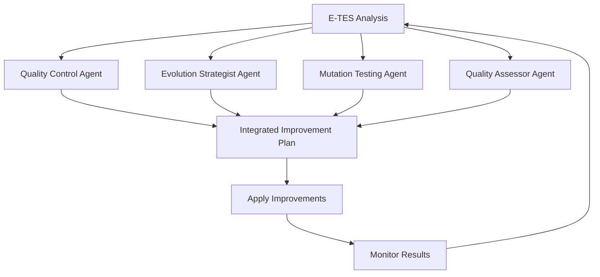

# E-TES v2.0: Evolutionary Test Effectiveness Score

## 🎯 Overview

E-TES v2.0 is a revolutionary test effectiveness scoring system that uses evolutionary algorithms and multi-objective optimization to create self-improving test suites. It extends the traditional TES with advanced capabilities including adaptive mutation testing, assertion intelligence analysis, and comprehensive quality assessment.

## 🧬 Core Formula

```
E-TES = MS × EG × AIQ × BC × SF × QF
```

Where:
- **MS**: Mutation Score (weighted by severity)
- **EG**: Evolution Gain (1 + improvement_rate)
- **AIQ**: Assertion Intelligence Quotient
- **BC**: Behavior Coverage (critical paths)
- **SF**: Speed Factor (logarithmic)
- **QF**: Quality Factor (stability × determinism)

## 🚀 Key Features

### 1. Adaptive Evolutionary Mutation Testing (EMT)
- **Smart Mutant Generation**: Context-aware mutations based on code complexity and fault patterns
- **Multi-Objective Optimization**: NSGA-II based selection balancing multiple quality dimensions
- **Self-Adapting Parameters**: Mutation rates and population diversity automatically adjust
- **Early Convergence Detection**: Stops evolution when optimal solutions are found

### 2. Assertion Intelligence Quotient (AIQ)
- **Type-Aware Scoring**: Different assertion types weighted by effectiveness
- **Invariant Detection**: Bonus scoring for property-based and invariant assertions
- **Redundancy Analysis**: Penalties for duplicate or unnecessary assertions
- **Target Criticality**: Assertions weighted by the criticality of tested components

### 3. Advanced Quality Factor (QF)
- **Determinism Analysis**: Consistency across multiple test runs
- **Stability Assessment**: Resistance to environmental changes
- **Clarity Metrics**: Code readability and maintainability scoring
- **Independence Evaluation**: Coupling and dependency analysis

### 4. Evolution History Tracking
- **Trend Analysis**: Improvement rates and convergence patterns
- **Performance Insights**: Actionable recommendations for optimization
- **Plateau Detection**: Identifies when evolution has stagnated
- **Resource Monitoring**: Tracks computation time and memory usage

## 📦 Architecture

```
guardian/
├── core/
│   ├── etes.py              # Core E-TES calculator
│   └── tes.py               # Enhanced TES with E-TES integration
├── evolution/
│   ├── adaptive_emt.py      # Evolutionary mutation testing engine
│   ├── smart_mutator.py     # Context-aware mutation generation
│   ├── operators.py         # Crossover and mutation operators
│   └── fitness.py           # Multi-objective fitness evaluation
├── metrics/
│   ├── quality_factor.py    # Quality factor calculator
│   └── evolution_history.py # Evolution tracking and analysis
└── cli.py                   # Enhanced CLI with E-TES support
```

## 🛠️ Installation

1. **Install Dependencies**:
```bash
cd guardian_ai_tool
pip install -e .
```

2. **Verify Installation**:
```bash
python test_etes_v2.py
```

## 📖 Usage

### Command Line Interface

```bash
# Basic analysis with E-TES v2.0
guardian /path/to/project --use-etes-v2

# Full analysis with user stories
guardian /path/to/project \
  --use-etes-v2 \
  --user-stories-file stories.txt \
  --test-path tests/ \
  --output-format json
```

### Programmatic Usage

```python
from guardian.core.etes import ETESCalculator, ETESConfig
from guardian.core.tes import calculate_etes_v2

# Configure E-TES
config = ETESConfig(
    max_generations=10,
    population_size=100,
    min_mutation_score=0.80,
    min_behavior_coverage=0.90
)

# Prepare test data
test_suite_data = {
    'mutation_score': 0.85,
    'assertions': [...],
    'covered_behaviors': [...],
    'execution_results': [...],
    # ... more metrics
}

codebase_data = {
    'all_behaviors': [...],
    'behavior_criticality': {...},
    'complexity_metrics': {...}
}

# Calculate E-TES
etes_score, components = calculate_etes_v2(
    test_suite_data, 
    codebase_data, 
    config
)

print(f"E-TES Score: {etes_score:.3f}")
print(f"Components: {components}")
```

### Evolution Engine

```python
from guardian.evolution.adaptive_emt import AdaptiveEMT

# Initialize evolution engine
emt = AdaptiveEMT(
    codebase_path="/path/to/code",
    test_suite_path="/path/to/tests",
    population_size=100,
    max_generations=20
)

# Evolve test suite
optimized_tests = emt.evolve(early_stop=True)

# Get evolution summary
summary = emt.get_evolution_summary()
print(f"Best fitness: {summary['best_fitness_achieved']:.3f}")
print(f"Converged at generation: {summary['convergence_generation']}")
```

## 📊 Output Example

```
--- Guardian Analysis Report ---
Project: /path/to/my-project
Status: analysis_partial
Overall TES Score: 0.456 (Grade: F)
E-TES v2.0 Score: 0.847 (Grade: A)

E-TES v2.0 Components:
  Mutation Score: 0.823
  Evolution Gain: 1.156
  Assertion IQ: 0.891
  Behavior Coverage: 0.940
  Speed Factor: 0.960
  Quality Factor: 0.887

E-TES Insights:
  • Strong evolution gain detected - test suite is improving
  • Behavior coverage exceeds target (0.90)
  • Test execution speed is optimal

E-TES Improvement: +0.391 over legacy TES

E-TES Recommendations:
  • E-TES v2.0 shows significant improvement - recommend migration
  • Strong evolution gain detected - test suite is improving
```

## 🎯 Quality Gates

E-TES v2.0 includes configurable quality gates:

```yaml
quality_gates:
  - gate: mutation_score
    min: 0.80
    weight: critical
  - gate: behavior_coverage
    min: 0.90
    weight: high
  - gate: speed_factor
    max_ms: 200
    weight: medium
  - gate: quality_factor
    min: 0.85
    weight: high
```

## 🔬 Advanced Features

### Smart Mutation Patterns

E-TES v2.0 includes built-in fault patterns:

- **Off-by-one errors**: Range and boundary mutations
- **Null pointer dereference**: Object reference mutations
- **Boolean logic errors**: Logical operator mutations
- **Arithmetic operator errors**: Mathematical operation mutations
- **Comparison operator errors**: Relational operator mutations

### Multi-Objective Fitness

The evolution engine optimizes for:

1. **Mutation Killing Effectiveness**
2. **Execution Speed**
3. **Assertion Quality**
4. **Coverage Breadth**
5. **Test Maintainability**
6. **Fault Detection Capability**

### Evolution Insights

Real-time tracking provides:

- **Improvement Rate**: Rate of score improvement per generation
- **Convergence Detection**: Automatic stopping when optimal
- **Diversity Monitoring**: Population diversity tracking
- **Resource Usage**: Memory and computation monitoring

## 🧪 Testing

Run the comprehensive test suite:

```bash
python test_etes_v2.py
```

This tests:
- Core E-TES calculation
- Smart mutation generation
- Quality factor assessment
- Evolution history tracking
- TES vs E-TES comparison

## 📈 Performance

E-TES v2.0 is designed for efficiency:

- **Parallel Evaluation**: Multi-threaded fitness assessment
- **Adaptive Parameters**: Self-tuning for optimal performance
- **Early Stopping**: Convergence detection prevents over-computation
- **Caching**: Intelligent caching of expensive operations

## 🔧 Configuration

### ETESConfig Options

```python
config = ETESConfig(
    # Evolution parameters
    max_generations=10,
    population_size=100,
    mutation_rate=0.1,
    crossover_rate=0.7,
    elitism_rate=0.1,
    
    # Quality thresholds
    min_mutation_score=0.80,
    min_behavior_coverage=0.90,
    max_test_runtime_ms=200.0,
    
    # Component weights
    weights={
        'mutation_score': 0.25,
        'evolution_gain': 0.15,
        'assertion_iq': 0.20,
        'behavior_coverage': 0.20,
        'speed_factor': 0.10,
        'quality_factor': 0.10
    }
)
```

## 🚨 Migration from TES

E-TES v2.0 is backward compatible:

1. **Gradual Migration**: Run both TES and E-TES in parallel
2. **Comparison Analysis**: Built-in comparison tools
3. **Configuration Mapping**: Automatic parameter translation
4. **Validation**: Extensive testing ensures reliability

## 🤝 Contributing

E-TES v2.0 is designed for extensibility:

- **Custom Mutation Operators**: Add domain-specific mutations
- **Fitness Functions**: Implement custom quality metrics
- **Evolution Strategies**: Experiment with different algorithms
- **Quality Assessors**: Add new quality dimensions

## 📚 References

- NSGA-II Multi-Objective Optimization
- Mutation Testing Best Practices
- Test Quality Assessment Frameworks
- Evolutionary Algorithm Design Patterns

## 🏆 Benefits

### For Developers
- **Actionable Insights**: Clear recommendations for test improvement
- **Automated Optimization**: Self-improving test suites
- **Quality Assurance**: Comprehensive quality assessment
- **Performance Monitoring**: Real-time evolution tracking

### For Teams
- **Standardized Metrics**: Consistent quality measurement
- **Trend Analysis**: Long-term quality tracking
- **Resource Optimization**: Efficient test suite management
- **Risk Assessment**: Critical path coverage analysis

### For Organizations
- **ROI Measurement**: Quantifiable test investment returns
- **Quality Gates**: Automated quality enforcement
- **Compliance**: Standardized quality reporting
- **Continuous Improvement**: Evolutionary optimization

## 🤖 AI Agent Integration

E-TES v2.0 includes comprehensive AI agent system prompts for automated quality control and testing. These agents can interface with the E-TES system to provide intelligent, autonomous test improvement.

### Available AI Agents

#### 1. E-TES Quality Control Agent
**Purpose**: Monitor and improve test effectiveness using evolutionary algorithms
**Capabilities**:
- Mutation analysis and weak spot identification
- Assertion intelligence assessment
- Behavior mapping and coverage optimization
- Evolution tracking and convergence analysis

#### 2. E-TES Evolution Strategist Agent
**Purpose**: Design and optimize evolutionary strategies for test suite improvement
**Capabilities**:
- Population management and diversity control
- Multi-objective optimization with NSGA-II
- Adaptive parameter tuning
- Convergence optimization and early stopping

#### 3. E-TES Mutation Testing Agent
**Purpose**: Intelligent mutation generation and analysis for fault detection
**Capabilities**:
- Context-aware mutant generation
- Severity-weighted mutation scoring
- Fault pattern recognition
- Equivalent mutant detection and filtering

#### 4. E-TES Test Quality Assessor Agent
**Purpose**: Comprehensive evaluation of test suite quality dimensions
**Capabilities**:
- Test determinism and flakiness analysis
- Stability and maintainability assessment
- Clarity and readability evaluation
- Independence and coupling analysis

### Agent Integration Example

```python
# Initialize AI agents for E-TES optimization
from guardian.ai_agents import ETESQualityControlAgent, ETESEvolutionStrategistAgent

# Quality analysis
quality_agent = ETESQualityControlAgent()
analysis = quality_agent.analyze({
    "test_suite_data": test_data,
    "codebase_data": codebase_data,
    "current_etes_score": 0.75
})

# Evolution strategy
evolution_agent = ETESEvolutionStrategistAgent()
strategy = evolution_agent.design_strategy(analysis)

# Apply recommendations
improvement_plan = integrate_agent_outputs(analysis, strategy)
```

### System Prompts

Complete AI agent system prompts are available in `AI_AGENT_SYSTEM_PROMPTS.md`. These prompts enable:

- **Structured JSON responses** for programmatic integration
- **Multi-objective decision making** with clear trade-off analysis
- **Contextual recommendations** based on codebase characteristics
- **Continuous learning** from historical improvement data

### Agent Coordination Workflow



## 🎮 Gamified Monitoring Interface

E-TES v2.0 includes a revolutionary gamified monitoring system that makes code quality improvement engaging and rewarding for human developers.

### Achievement System

Unlock **20+ achievements** across multiple categories:

- **Score Milestones**: First Steps, Excellence, Perfection
- **Improvement Streaks**: On a Roll, Unstoppable, Legendary
- **Speed Achievements**: Speed Demon, Lightning Fast
- **Quality Mastery**: Quality Guru, Zen Master
- **Evolution Mastery**: Evolution Master, Darwin Award
- **Bug Hunting**: Bug Hunter, Exterminator

### Level Progression

- **Experience Points**: Earned through E-TES improvements and achievements
- **Level System**: 10 levels from Novice to E-TES Master
- **Visual Progress**: Beautiful progress bars and level indicators
- **Milestone Rewards**: Special recognition for major achievements

### Beautiful Console Interface

- **Stunning Visuals**: RGB colors, animations, and visual effects
- **Real-time Updates**: Live monitoring of E-TES evolution
- **Progress Tracking**: Visual progress bars and trend indicators
- **Celebration Effects**: Achievement unlocks with visual flair

### Usage

```python
from guardian.self_improvement import GamifiedMonitor

# Start gamified monitoring
monitor = GamifiedMonitor()
monitor.start_monitoring(update_interval=2.0)

# Achievement updates happen automatically
# Beautiful console output engages human observers
```

## 🧬 Guardian Self-Improvement

The ultimate proof of concept: **Guardian improving itself using its own E-TES v2.0 system!**

### Self-Optimization Engine

```python
from guardian.self_improvement import GuardianOptimizer, SelectionMode

# Initialize self-improvement
optimizer = GuardianOptimizer(
    guardian_root="/path/to/guardian",
    selection_mode=SelectionMode.GUIDED  # or RANDOM, HYBRID
)

# Run improvement cycle
results = optimizer.run_improvement_cycle(max_iterations=10)

# Guardian optimizes its own:
# - E-TES calculation engine
# - Evolution algorithms
# - Static analysis capabilities
# - Test execution performance
# - CLI interface usability
```

### Selection Modes

- **GUIDED**: AI-driven intelligent selection based on priority and impact
- **RANDOM**: Random selection for comparison and exploration
- **HYBRID**: 70% guided, 30% random for balanced optimization

### Improvement Targets

Guardian continuously improves:
1. **Core E-TES Engine** (Priority 1): Calculation accuracy and performance
2. **Evolution Algorithms** (Priority 1): Convergence and effectiveness
3. **Static Analysis** (Priority 2): Code smell detection and metrics
4. **Test Execution** (Priority 2): Speed and reliability
5. **CLI Interface** (Priority 3): Usability and error handling

---

**E-TES v2.0**: Where test effectiveness meets evolutionary intelligence. 🧬✨
